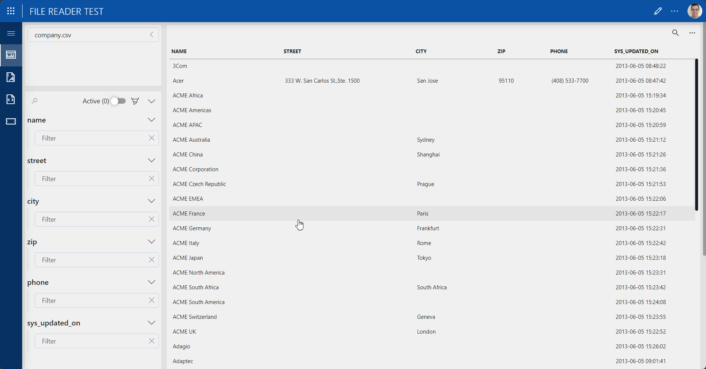

# File Reader GQI Tutorial

## About

This package demonstrates how to ingest raw CSV, JSON, and XML file data into DataMiner's Low-Code Apps module, and how to aggregate, manipulate, and correlate that data afterwards.
This package demonstrates how to ingest raw CSV, JSON, and XML file data into DataMiner's Low-Code Apps module using the ad hoc data sources found in the [File Reader](https://catalog.dataminer.services/details/0d9b64f3-81d0-46e6-bd3f-5fced5339103) package, and how to aggregate, manipulate, and correlate that data afterwards.

## Use Cases
## Getting started

1. Deploy the package to add a low-code app named *File Reader Test* to your DMA.
1. Open the app
   - In the *Apps* section of DataMiner Cube, or
   - On the root page of your DMA.
## Technical Reference
If you have any questions, or if you encounter issues that are not addressed in the documentation, contact Skyline support at <support@dataminer.services>.