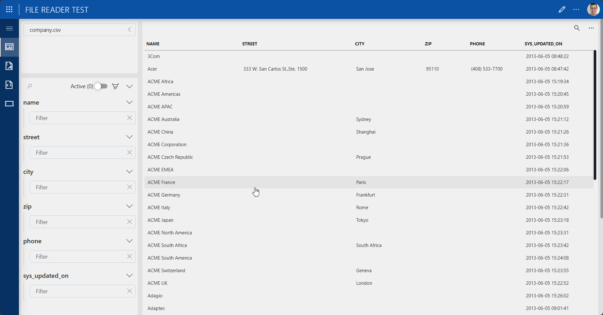

# File Reader GQI Tutorial

## Overview
This demonstration shows the ease of ingesting any file types into Dataminer's Low Code App's module, converting raw file data into a beautiful presentation with the ability to aggregate, manipulate, and correlate. This demo shows how versatile and simple it is to create these apps for CSV, JSON, and XML files.

## How to use

After deploying the package, a Low Code App called "File Reader Test" will be added to the DMA. This can be accessed via Cube in the Apps section or navigating to the DMA's home page in your preferred web browser.

## Support

For questions or issues not addressed in the documentation, contact Skyline support at techsupport@skyline.be.